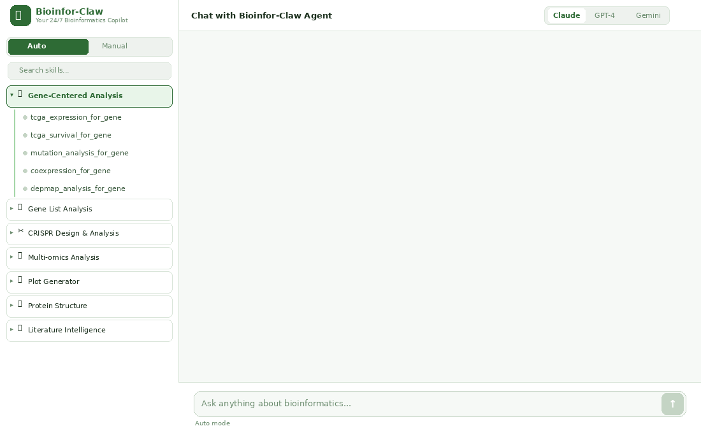

<p align="center">
  
</p>

<p align="center">
  <a href="#60-second-quick-start"></a>
  
  
  
  
  
</p>

<p align="center">
  <strong>English</strong> &nbsp;|&nbsp; <a href="README.zh-CN.md">简体中文</a>
</p>

# Bioinfor-Claw

**Your 24/7 bioinformatics copilot — run 50 specific skills across 10 application scenarios in daily bioinformatic analysis with ease.**

Bioinfor-Claw is two things in one project:

1. **A standalone bioinformatics agent.** Clone the repo, run a single command, and you get a browser-based chat UI backed by an autonomous agent that can choose tools, run analyses, remember context across turns, and return publication-ready figures and tables. No external agent framework required.
2. **A modular skill library.** All 50 analysis capabilities are packaged as self-contained, agent-friendly skills (each with a `SKILL.md`, a working Python implementation, and explicit input/output contracts) that plug into OpenClaw, Claude Code, or any custom agent that scans `SKILL.md` files.

This dual nature is intentional. Use Bioinfor-Claw on its own as a "desktop AI bench scientist," embed it inside a larger agent platform you already run, or call individual skills directly from your scripts and pipelines — the same skills work in all three modes.

<p align="center">
  
  <br>
  <em>One prompt → automatic skill selection → real analysis → publication-ready results</em>
</p>

---

## Table of contents

- [Why Bioinfor-Claw](#why)
- [Key capabilities at a glance](#capabilities)
- [60-second quick start](#quickstart)
- [Architecture](#architecture)
- [Who this is for](#audience)
- [Installation paths](#install)
  - [Option 1 — Built-in agent + web UI](#install-builtin)
  - [Option 2 — OpenClaw](#install-openclaw)
  - [Option 3 — Claude Code](#install-claudecode)
  - [Option 4 — Direct CLI / pipelines](#install-cli)
- [Hosting online](#hosting)
- [Built-in agent — feature deep dive](#agent-features)
- [Skill catalog](#skills)
- [Workflow examples](#workflows)
- [Design principles](#principles)
- [Roadmap](#roadmap)
- [Contributing](#contributing)
- [License & contact](#license)

---

<a id="why"></a>
## Why Bioinfor-Claw

Modern bioinformatics is fragmented. A single research question — *"is gene X prognostic in this cancer, and does its mutation profile suggest a CRISPR target?"* — typically spans a public data portal, a local analysis script, a plotting notebook, a literature search, and a structure viewer, often glued together by hand.

Bioinfor-Claw collapses that loop into a conversational interface backed by curated, reproducible skills. You describe what you want; the agent picks the right tool, fills in the parameters, runs it, and returns the result with provenance. Behind the conversational layer, the same skills remain ordinary, well-documented Python scripts you can audit, modify, or call directly without the agent.

**What that means concretely:**

- For day-to-day analysis: stop context-switching between portals, scripts, and plotting code.
- For reproducibility: every skill is a versioned script with explicit inputs, outputs, and dependencies — not an opaque black box.
- For automation: chain skills into modular workflows, either manually or by letting the agent orchestrate.
- For interoperability: the same SKILL.md files are consumed by Bioinfor-Claw's own agent, OpenClaw, Claude Code, or any future framework you migrate to.

---

<a id="capabilities"></a>
## Key capabilities at a glance

### As an autonomous agent

| Capability | What it does |
|---|---|
| Auto-routing agent loop | Reads `SKILL.md` files, picks the right skill from a plain-English request, fills required flags, executes, recovers from errors |
| Multi-LLM backend | Anthropic, OpenAI, Google, Mistral, MiniMax — plus a Custom tab that accepts any OpenAI-compatible endpoint (DeepSeek, xAI, Moonshot, Ollama, LM Studio, vLLM, …). Switched per session. |
| Cross-turn memory | Tracks discussed entities (genes, cancers, UniProt IDs), recent analyses, and user preferences (font, DPI, species) so follow-up questions don't lose context |
| Configurable step budget | Default 30 tool-calling rounds per request; auto-bumped to 45+ when the agent detects modular / multi-dataset workflows |
| Fingerprint deduplication | Blocks identical re-runs of the same skill+args while allowing legitimate modular parameter sweeps |
| File handling | Drag-and-drop CSV / TSV / VCF / FASTA / JSON / BED upload; server paths automatically wired into `run_script` calls |
| Result rendering | Inline plot previews, consolidated downloads card, error trace collapsible for power users |
| Browser-native UI | Single self-contained HTML, no build step, works offline once skills are bundled |

### As a skill library

| Capability | What it does |
|---|---|
| 50 specialized skills | Spanning data access, multi-omics, CRISPR, gene-list, gene-centered, structure, ML, plotting, literature, lab tracking |
| Standardized SKILL.md | Each skill declares purpose, inputs, outputs, execution policy, and trigger phrases — readable by humans and agents alike |
| Pure-Python implementations | numpy / pandas / matplotlib / scipy / lifelines stack; no R dependency |
| Per-skill `requirements.txt` | Install only the dependencies you need |
| Stable file naming and TSV/PNG/SVG outputs | Designed for downstream chaining without glue code |

### As an integration

| Platform | How it integrates |
|---|---|
| Bioinfor-Claw's own agent | Native — bundled launcher loads skills automatically |
| OpenClaw | Auto-installer registers all 50 skills via `extraDirs` in `~/.openclaw/openclaw.json` |
| Claude Code | Skills auto-discovered when Claude Code is launched from the repo root |
| Custom agents | Any framework that scans `SKILL.md` files works; each skill has self-describing argparse interfaces |
| Direct CLI / Snakemake / Nextflow | Every skill is a standalone `python script.py --flag value` invocation |

---

<a id="quickstart"></a>
## 60-second quick start

```bash
# Clone
git clone https://github.com/MDhewei/bioinfor-claw.git
cd bioinfor-claw

# Install all 50 skills' dependencies (one shot)
bash setup.sh --all
source .venv/bin/activate

# Launch the bundled agent + web UI
python3 run_bioinfor_claw.py
```

Your browser opens to `http://localhost:7860`. Click **⚙ Settings**, paste an API key for any supported LLM provider, and start chatting:

```
Run TCGA survival analysis for PRNP in stomach adenocarcinoma
Plot a volcano for my DEG table (attached)
Compare TP53 expression across all TCGA cancer types
Design SpCas9 sgRNAs for KRAS in human
```

The agent reads the relevant `SKILL.md`, picks the right script, fills in the flags, executes on your machine, and returns figures + result tables in the chat.

---

<a id="architecture"></a>
## Architecture

```
                    ┌──────────────────────────────────────────────┐
                    │           Browser-based Chat UI              │
                    │  (bioinfor-claw.html, single self-contained  │
                    │   HTML; multi-LLM provider switcher; file    │
                    │   upload; consolidated output panel)         │
                    └────────────────────┬─────────────────────────┘
                                         │  HTTP (localhost or tunnel)
                    ┌────────────────────▼─────────────────────────┐
                    │           Local Agent Server                 │
                    │            run_bioinfor_claw.py              │
                    │  ┌────────────────────────────────────────┐  │
                    │  │  Agent loop (provider-native tool use) │  │
                    │  │  • plan → call tool → observe → repeat │  │
                    │  │  • cross-turn memory (entities, runs)  │  │
                    │  │  • fingerprint dedup, step budget mgmt │  │
                    │  └────────────────────────────────────────┘  │
                    │  ┌────────────────────────────────────────┐  │
                    │  │  Tool surface                           │  │
                    │  │  list_skills · read_skill ·             │  │
                    │  │  list_skill_scripts · run_script ·      │  │
                    │  │  list_files · read_file                 │  │
                    │  └────────────────────────────────────────┘  │
                    └────────────────────┬─────────────────────────┘
                                         │
                    ┌────────────────────▼─────────────────────────┐
                    │              Skill Library                   │
                    │  10 scenarios · 50 skills                    │
                    │                                              │
                    │  Each skill:                                 │
                    │    • SKILL.md   (purpose, inputs, outputs,   │
                    │                  execution policy, triggers) │
                    │    • scripts/   (pure-Python implementation) │
                    │    • requirements.txt                        │
                    └────────────────────┬─────────────────────────┘
                                         │
                                         ▼
                            Outputs: TSV / CSV / PNG / SVG /
                            JSON / interactive HTML / markdown
```

The same `Skill Library` layer is consumed by **OpenClaw** (via `extraDirs` registration), **Claude Code** (via project-root scan), or **any custom agent** that reads `SKILL.md` — Bioinfor-Claw's own agent is one consumer among several.

---

<a id="audience"></a>
## Who this is for

Bioinfor-Claw is built for people who do recurring computational biology work and want to spend more time on the science and less time on the plumbing.

- Computational biologists and bioinformaticians
- Cancer genomics and functional genomics researchers
- CRISPR screen designers and analysts
- Molecular biologists who depend on public omics datasets
- Wet-lab PIs who want a structured AI assistant their trainees can use safely
- Developers building scientific AI assistants
- Labs that want reusable, auditable analysis workflows
- Companies prototyping automated bioinformatics pipelines

It is especially useful for bridging:

- public data access
- analysis automation
- agent-based research assistance
- reusable scientific utilities

---

<a id="install"></a>
## Installation paths

Pick the option that matches your existing setup. All four use the same underlying skill library — switching later is a `git clone` away.

| Your situation | Use |
|---|---|
| First-time user, want it working with minimum friction | **Option 1 — Built-in agent** |
| Already running OpenClaw as your daily agent | **Option 2 — OpenClaw** |
| Already use Claude Code in the terminal | **Option 3 — Claude Code** |
| Want to call one skill from a script, Snakemake, or Nextflow | **Option 4 — Direct CLI** |

### Prerequisites

- Python ≥ 3.9
- git
- curl (only for the OpenClaw one-liner)

---

<a id="install-builtin"></a>
### Option 1 — Built-in agent + web UI (recommended for first-time users)

Bioinfor-Claw includes its own autonomous agent and chat UI bundled as a single self-contained launcher. No external agent framework, no npm, no extra accounts.

#### Step 1 — Clone and install dependencies

```bash
git clone https://github.com/MDhewei/bioinfor-claw.git
cd bioinfor-claw
bash setup.sh --all          # installs all 50 skill dependencies
source .venv/bin/activate
```

`setup.sh` options:

| Command | What it does |
|---|---|
| `bash setup.sh` | Install core launcher dependencies only |
| `bash setup.sh --all` | Install all 50 skills' dependencies in one shot |
| `bash setup.sh --skill <skill-name>` | Install one skill's dependencies |
| `bash setup.sh --list` | List all available skills |

#### Step 2 — Launch the agent

```bash
python3 run_bioinfor_claw.py
```

The launcher will:

1. Scan the repo and bundle every `SKILL.md` into the app at startup
2. Start a local HTTP server on port `7860`
3. Open your default browser to the chat UI

#### Step 3 — Configure and chat

In the web UI, click **⚙ Settings** (top-right), choose your LLM provider, paste an API key, and start typing requests in plain English. The agent does the rest.

#### Launcher options

```bash
# Use a different port
python3 run_bioinfor_claw.py --port 8080

# Headless: don't open the browser
python3 run_bioinfor_claw.py --no-browser

# Bind to all interfaces (for LAN / behind a tunnel — see "Hosting online")
python3 run_bioinfor_claw.py --host 0.0.0.0 --port 8000 --no-browser

# Point to a different repo location
python3 run_bioinfor_claw.py --repo /path/to/bioinfor-claw
```

#### Updating

```bash
cd bioinfor-claw
git pull
bash setup.sh --all       # install any new dependencies
# Restart run_bioinfor_claw.py to re-bundle the updated SKILL.md files
```

---

<a id="install-openclaw"></a>
### Option 2 — OpenClaw

[OpenClaw](https://openclaw.ai) is an open-source autonomous AI agent. It discovers skills by scanning directories for `SKILL.md` files. Skills installed globally live in `~/.openclaw/skills/`; additional directories can be registered in `~/.openclaw/openclaw.json` via `skills.load.extraDirs`.

The `install-openclaw.sh` script handles everything in one command: cloning the repo, installing Python dependencies, and permanently registering all 50 skills in your OpenClaw config.

#### Step 1 — Install OpenClaw

If you do not have OpenClaw yet, follow the setup guide at [openclaw.ai](https://openclaw.ai). You will need Node 22+ and an API key from your chosen LLM provider.

#### Step 2 — Run the bioinfor-claw installer

```bash
bash <(curl -sSL https://raw.githubusercontent.com/MDhewei/bioinfor-claw/main/install-openclaw.sh)
```

The installer will:

1. Clone bioinfor-claw to `~/.bioinfor-claw/`
2. Create a Python virtual environment and install all skill dependencies
3. Add the bioinfor-claw skill directories to `skills.load.extraDirs` in `~/.openclaw/openclaw.json`
4. Verify the skills are discoverable via `openclaw skills list`

> **How `extraDirs` works:** OpenClaw's config supports a `skills.load.extraDirs` list — an array of directories it scans for skill folders at startup. The installer patches this list in `~/.openclaw/openclaw.json` so OpenClaw finds all 50 bioinfor-claw skills automatically on every run, without copying any files.

#### Step 3 — Restart OpenClaw and verify

```bash
openclaw restart           # or stop + start your OpenClaw session
openclaw skills list       # all 50 bioinfor-claw skills should appear
```

#### Step 4 — Use it

Ask anything in natural language through your OpenClaw interface; OpenClaw reads the relevant `SKILL.md`, selects the correct parameters, and runs the Python script.

#### Updating skills

Because skills are registered via `extraDirs` (not copied), a simple `git pull` is enough:

```bash
git -C ~/.bioinfor-claw pull
```

#### Installer options

```bash
# Change where the repo is cloned (default: ~/.bioinfor-claw)
bash <(curl -sSL .../install-openclaw.sh) --install-dir ~/tools/bioinfor-claw

# Point to a non-default openclaw.json location
bash <(curl -sSL .../install-openclaw.sh) --config ~/.config/openclaw/openclaw.json

# Copy skills into ~/.openclaw/skills/ instead of using extraDirs
bash <(curl -sSL .../install-openclaw.sh) --copy
```

---

<a id="install-claudecode"></a>
### Option 3 — Claude Code (terminal)

[Claude Code](https://docs.anthropic.com/en/docs/claude-code) is Anthropic's terminal-based AI coding agent. It discovers skills by finding `SKILL.md` files inside the project you open it in. No registration is needed — just clone the repo and launch Claude Code from inside it.

#### Step 1 — Install Claude Code

```bash
npm install -g @anthropic-ai/claude-code
```

#### Step 2 — Clone and set up bioinfor-claw

```bash
git clone https://github.com/MDhewei/bioinfor-claw.git
cd bioinfor-claw
bash setup.sh --all
source .venv/bin/activate
```

#### Step 3 — Launch Claude Code from the repo root

```bash
claude
```

Claude Code scans the project, finds every `SKILL.md`, and immediately knows what each skill does, when to use it, and how to call it.

#### Step 4 — Use it

```
You: Run survival analysis for TP53 in TCGA breast cancer
Claude Code: reads tcge_survival_for_gene/SKILL.md → calls script with
             --gene TP53 --cancer-type BRCA --mode os → returns KM plot + TSV

You: Visualize the 3D structure of EGFR and detect pockets
Claude Code: reads protein-structure-visualizer/SKILL.md → fetches PDB,
             runs pocket detection, returns interactive HTML viewer
```

#### Updating

```bash
cd bioinfor-claw && git pull && bash setup.sh --all
```

---

<a id="install-cli"></a>
### Option 4 — Direct CLI / pipelines

Each skill is a standalone Python script, callable from any shell, Makefile, Snakemake rule, or Nextflow process — no agent involved.

```bash
# Clone and set up
git clone https://github.com/MDhewei/bioinfor-claw.git
cd bioinfor-claw
bash setup.sh --skill tcge_survival_for_gene
source .venv/bin/activate

# Run the skill directly
python gene-centered-analysis/tcge_survival_for_gene/scripts/tcga_survival_for_gene.py \
  --gene TP53 --cancer-type BRCA --mode os --outdir results/
```

#### Conda alternative to venv

```bash
conda create -n bioinfor-claw python=3.11 -y
conda activate bioinfor-claw

git clone https://github.com/MDhewei/bioinfor-claw.git
cd bioinfor-claw
bash setup.sh --all
```

---

<a id="hosting"></a>
## Hosting online

The built-in agent is local-first by default (binds to `localhost`), but it's straightforward to make it reachable from your phone, tablet, or another machine. Pick the model that matches your security posture.

| Approach | Best for | What you get |
|---|---|---|
| **Tailscale** | Personal use; you only want yourself or a few trusted devices to connect | Private virtual network, zero public attack surface, transparent SSO via your tailnet |
| **Cloudflare Tunnel** | A small, vetted group; you want a public HTTPS URL but with email-based access control | Public hostname (e.g. `claw.yourdomain.com`), automatic TLS, Cloudflare Access policies for per-user gating |
| **Cloud VM (DigitalOcean / Hetzner / Lightsail)** | Always-on access, larger compute, electricity and uptime independent of your laptop | Full SSH control, nginx + Let's Encrypt + basic auth, `systemd` service, persistent disk for `web_results/` |

Concrete starting points:

```bash
# Tailscale: install on the host, then run
python3 run_bioinfor_claw.py --host 0.0.0.0 --port 7860 --no-browser
# Visit http://<machine-name>:7860 from any tailnet device

# Cloudflare Tunnel: keep the server bound to localhost
cloudflared tunnel --url http://localhost:7860
# Then add a Cloudflare Access policy on the resulting hostname

# Cloud VM: reverse-proxy through nginx with HTTPS
# (Run the launcher under systemd; serve via 443 with Let's Encrypt + basic auth)
```

The frontend auto-detects the server origin, so no code changes are needed when you switch between local and remote access.

> **A note on security:** the agent can execute arbitrary skills (which run Python scripts on the host). Never expose `run_bioinfor_claw.py` directly to the public internet without an authentication layer (Tailscale, Cloudflare Access, or HTTP basic auth at minimum). Treat it like an SSH endpoint.

---

<a id="agent-features"></a>
## Built-in agent — feature deep dive

### Auto-routing

The agent's tool surface is intentionally narrow: `list_skills`, `read_skill`, `list_skill_scripts`, `run_script`, `list_files`, `read_file`. Given a request, the agent calls `list_skills` → reads the matching `SKILL.md` → optionally inspects argparse via `list_skill_scripts` → calls `run_script` with a fully-specified flag list. Errors are caught from stderr and corrected on the next iteration.

### Cross-turn memory

State persists across conversation turns:

- **Entities tracked**: genes, cancer types, UniProt IDs, PDB IDs, species mentioned by either party
- **Analysis history**: the last 20 successful runs (skill, script, parameters, key findings, output files)
- **User preferences**: font, DPI, species, and other recurring stylistic choices, learned from past requests
- **Session context summary**: a compact one-paragraph synthesis injected into the system prompt so the agent never says "which analysis are you referring to?" when you ask a follow-up

The recent 12 user/assistant exchanges are sent verbatim; older exchanges are summarized to stay within token budget.

### Configurable step budget

Each user request is allowed up to N agent rounds (default 30, configurable in ⚙ Settings from 8 to 60). For requests that look modular ("all TCGA cancer types," "every module on this gene," patterns matching multiple datasets), the budget auto-bumps to at least 45 so the agent can finish.

### Fingerprint deduplication

The agent maintains a per-request set of `(skill, script, input_file, args)` fingerprints for successful runs. Re-issuing an identical call returns a "blocked" tool result with guidance to either move on to the next module or write the final summary. Different scripts or different args always pass through — modular workflows are unaffected.

### Multi-LLM backend

| Provider tab | Default model | Tool-use translation |
|---|---|---|
| Anthropic | claude-sonnet-4-5 | Native |
| OpenAI | gpt-4o-mini | Native |
| Google | gemini-2.0-flash-exp | OpenAI-compatible |
| Mistral | mistral-large | OpenAI-compatible |
| MiniMax | minimax-text-01 | OpenAI-compatible |
| Custom | user-defined (OpenAI-compatible) | OpenAI-compatible |

Five first-class provider tabs, plus a **Custom** tab that works with any OpenAI-compatible `/v1/chat/completions` endpoint — so DeepSeek, xAI/Grok, Moonshot, Ollama, LM Studio, vLLM, llama.cpp's server, and your own in-house LLM all drop in without code changes. Switch provider in the UI without restart; conversation history is preserved.

### File handling

Drag-and-drop files into the chat. The launcher uploads them to `web_results/uploads/`, returns a server-side path, and the agent automatically passes that path as the `input_file` argument to `run_script`. Supports CSV, TSV, FASTA, FASTQ, VCF, TXT, JSON, BED, GFF, GTF, SAM, XLSX, and PDF.

### Result rendering

Every `run_script` output is collected, deduplicated by URL, and rendered in a single output-files card below the agent's narrative reply: PNG/SVG plots get inline thumbnails, TSV/CSV get download buttons, HTML viewers open in a new tab. The full agent trace is collapsed by default and expandable for debugging.

---

<a id="skills"></a>
## Skill catalog

Bioinfor-Claw is currently organized into **10 application scenarios covering 50 skills**. Every skill ships with a `SKILL.md`, a working Python implementation, and a `requirements.txt`.

### 1. public-datasets-access-and-download (3 skills)
Discovering, querying, downloading, caching, and organizing public biological datasets from NCBI GEO, TCGA/GDC, GTEx, and DepMap.

| Skill | Key inputs | Key outputs |
|---|---|---|
| `depmap-data-download` | release version, file categories | downloaded TSV files, manifest JSON |
| `tcga-download-data` | cancer types, data type (expression/mutations/CNV/clinical) | merged matrix TSV, manifest JSON |
| `gtex-download-data` | data type, genes, tissues, version | tissue-gene expression matrix TSV |
| `geo-download-data` | GSE accession | expression matrix, sample metadata, series info TSV |

### 2. multiomics-data-analysis (5 skills)
Transcriptomic, genomic, epigenomic, proteomic, and single-cell data analysis.

| Skill | Key inputs | Key outputs |
|---|---|---|
| `rnaseq-differential-expression` | count matrix, metadata, group labels | DE table, volcano, MA plot, heatmap |
| `atac-chipseq-downstream-analysis` | BED/narrowPeak files, genome | annotated peaks TSV, QC plots, differential peaks |
| `methylation-analysis` | beta matrix, sample metadata | DMP/DMR tables, volcano, clustering heatmap |
| `proteomics-analysis` | protein intensity matrix, metadata | normalized matrix, DE table, volcano, heatmap |
| `single-cell-basic-analysis` | raw count matrix (cells × genes) | UMAP, cluster labels, marker genes TSV, QC plots |

### 3. crispr-design-and-analysis (6 skills)
CRISPR reagent design across editing modalities and CRISPR screen analysis.

| Skill | Key inputs | Key outputs |
|---|---|---|
| `design-sgrnas-by-gene` | gene symbol, organism | sgRNA table with on/off-target scores |
| `design-base-editor-sgrnas` | gene symbol, editor type (CBE/ABE/dual) | ranked guide table, editing heatmap, guide map |
| `design-prime-editor-sgrnas` | gene, edit type (SNV/ins/del), editor | pegRNA table with PBS/RT template, nicking sgRNAs |
| `crispr-screen-analysis` | count table or FASTQs, treatment/control labels | gene summary, volcano, rank plots, hit TSV |
| `crispr-screen-qc` | sgRNA count matrix | QC metrics TSV, Gini index, replicate correlation plots |
| `crispr-library-design` | gene list, guides-per-gene, editor type | oligo order TSV, FASTA, GC/score distribution plots |

### 4. gene-list-analysis (7 skills)
Interpreting and summarizing gene sets or candidate gene lists.

| Skill | Key inputs | Key outputs |
|---|---|---|
| `function-annotation-for-gene-list` | gene list | functional annotation TSV |
| `go-analysis-for-gene-list` | gene list, organism | GO/KEGG/Reactome enrichment TSV, bubble plot |
| `gsea-for-ranked-gene-list` | ranked gene list | GSEA results TSV, enrichment plots |
| `curate-gene-list-by-function` | topic / function description | curated gene list TSV |
| `gene-list-overlap` | 2–6 gene list files | Jaccard matrix, Venn/UpSet plots, overlap TSVs |
| `ppi-network-for-gene-list` | gene list | STRING network edges, node metrics, network plot |
| `transcription-factor-enrichment` | gene list | TF ranking TSV, bar chart, TF–gene network plot |

### 5. gene-centered-analysis (8 skills)
Starting from one gene and analyzing it across biological contexts and public resources.

| Skill | Key inputs | Key outputs |
|---|---|---|
| `depmap-analysis-for-gene` | gene symbol, DepMap files | expression/mutation/CNV/essentiality TSVs + plots |
| `normal-tissue-expression-by-gene` | gene symbol | GTEx tissue expression TSV + barplot |
| `tcga-expression-for-gene` | gene symbol, mode | pan-cancer or cohort expression TSV + plots |
| `tcge-survival-for-gene` | gene symbol, TCGA cohort | KM curves (OS/DFS), log-rank p-value, survival TSV |
| `mutation-analysis-for-gene` | gene symbol, cancer types | lollipop plot, mutation frequency bar chart, hotspot TSV |
| `drug-sensitivity-for-gene` | gene symbol, PRISM data | drug correlation TSV, scatter + waterfall plots |
| `coexpression-for-gene` | gene symbol, dataset | co-expression TSV, network plot, optional GO enrichment |
| `cox-survival-analysis` | clinical/molecular matrix, time + event cols | HR table, forest plot, Schoenfeld residuals, risk scores |

### 6. protein-structure-analysis (5 skills)
Protein-centered and structure-aware interpretation.

| Skill | Key inputs | Key outputs |
|---|---|---|
| `protein-structure-for-gene` | gene symbol | UniProt features TSV, PDB table, AlphaFold entry, domain map |
| `protein-structure-visualizer` | PDB ID / UniProt / local PDB | HTML 3D viewer, contact map, B-factor plot, pocket TSV |
| `protein-sequence-analysis` | gene symbol or UniProt ID | feature map PNG, physicochemical properties, motifs TSV |
| `protein-structure-alignment` | two PDB IDs or files | RMSD, aligned structure, divergence plot |
| `protein-variant-mapper` | gene, variant list (e.g. A123V) | lollipop map, 3D HTML viewer with labeled variants |

### 7. machine-learning-and-deep-learning (3 skills)
ML workflows on omics data.

| Skill | Key inputs | Key outputs |
|---|---|---|
| `omics-ml-classifier` | feature matrix, label file | CV metrics, ROC curve, feature importance, confusion matrix |
| `dimensionality-reduction` | numeric matrix, metadata | PCA/UMAP/t-SNE projections TSV + scatter plots, loadings |
| `clustering-analysis` | numeric matrix | cluster labels TSV, silhouette plot, heatmap, dendrogram |

### 8. bioinformatics-plot-generator (5 skills + 1 router)
Publication-quality figure generation from bioinformatics result tables. Each sub-skill has 40–70 user-configurable parameters, 300 DPI PNG + SVG output, and full publication-grade styling.

| Skill | Key inputs | Key outputs |
|---|---|---|
| `plot-volcano` | result table (FC + p-value cols) | 300 DPI PNG + SVG, annotated TSV, quadrant counts |
| `plot-heatmap` | numeric matrix | clustered heatmap with dendrograms + annotation bars |
| `plot-box-violin` | value + group columns | box/violin/raincloud + pairwise stat brackets |
| `plot-scatter-bar` | numeric columns or matrix | scatter, bar, MA, corrmat, or bubble chart |
| `plot-survival` | time, event, group columns | KM curves, log-rank p-value, at-risk table, 300 DPI PNG + SVG |

### 9. paper-search-and-digest (4 skills)
Scientific literature retrieval, digestion, and preprint tracking.

| Skill | Key inputs | Key outputs |
|---|---|---|
| `big-papers-weekly-report` | topic keywords, date range | ranked paper TSV + PDF report |
| `paper-digest-single` | PMID / DOI / arXiv ID | structured markdown digest, metadata JSON |
| `pubmed-search` | PubMed query string, date range | results TSV, markdown report, keyword + timeline plots |
| `preprint-tracker` | keywords, date range, server | preprints TSV, digest report, trend plots |

### 10. lab-search-and-track (3 skills)
Searching, tracking, and discovering research labs and collaborators.

| Skill | Key inputs | Key outputs |
|---|---|---|
| `search-big-labs-by-field` | research field | lab/PI table with publication metrics |
| `track-lab-publications` | PI name, institution, years | publications TSV, lab report markdown, timeline plots |
| `find-collaborators` | topic list, years | collaborator ranking TSV, author-topic heatmap, profiles |

---

<a id="workflows"></a>
## Workflow examples

Skills are designed to be chained — outputs of one become inputs of the next. The built-in agent can execute these chains autonomously when you describe the goal in plain language.

### Example 1 — Full gene characterization

> *"Give me a complete picture of EGFR — expression, mutations, drug sensitivity, structure, and survival."*

```
depmap-data-download              → download expression + essentiality + PRISM files
depmap-analysis-for-gene          → profile EGFR across cell lines
drug-sensitivity-for-gene         → top PRISM drugs correlated with EGFR expression
tcga-download-data                → download TCGA LUAD expression + mutation data
tcga-expression-for-gene          → pan-cancer expression + tumor vs normal in LUAD
mutation-analysis-for-gene        → somatic mutation lollipop plot, hotspot analysis
cox-survival-analysis             → multivariate Cox model with EGFR + clinical covariates
gtex-download-data                → download GTEx TPM matrix
normal-tissue-expression-by-gene  → GTEx normal tissue distribution
protein-structure-for-gene        → UniProt domain map, PDB structures, AlphaFold entry
protein-structure-visualizer      → interactive 3D viewer, pocket search
protein-sequence-analysis         → physicochemical properties, motifs, PTM sites
```

### Example 2 — RNA-seq → Pathway → Network → Survival

> *"I have treated vs control RNA-seq data. What pathways change, which TFs drive them, and does the top hit affect survival?"*

```
rnaseq-differential-expression    → DE table + significant gene list
plot-volcano                      → publication-quality volcano of DE results
go-analysis-for-gene-list         → GO/KEGG/Reactome enrichment of DE genes
gsea-for-ranked-gene-list         → GSEA on full ranked gene list
transcription-factor-enrichment   → TFs regulating the DE gene set
ppi-network-for-gene-list         → STRING PPI network of top DE genes
coexpression-for-gene             → co-expression partners of top hit in TCGA
tcge-survival-for-gene            → KM survival for the top gene hit
cox-survival-analysis             → multivariate Cox regression with clinical confounders
```

### Example 3 — CRISPR screen → Hit validation → Library design

> *"I ran a CRISPR screen. QC the data, identify hits, validate against DepMap, then design a focused follow-up library."*

```
crispr-screen-qc                  → Gini index, replicate correlation, representation QC
crispr-screen-analysis            → MAGeCK RRA hit calling, volcano + rank plots
depmap-analysis-for-gene          → DepMap essentiality validation of top hits
go-analysis-for-gene-list         → pathway enrichment of hit gene list
ppi-network-for-gene-list         → PPI network of screen hits
crispr-library-design             → focused follow-up library for top 50 hits
```

### Example 4 — Single-cell → Differential → Structure

> *"Analyze my scRNA-seq data, find cell-type markers, then analyze the top marker gene structurally."*

```
single-cell-basic-analysis        → QC, UMAP, clustering, marker gene identification
gene-list-overlap                 → compare markers to known cell-type signatures
go-analysis-for-gene-list         → pathway enrichment per cell type's markers
dimensionality-reduction          → PCA/UMAP re-analysis with custom metadata coloring
protein-structure-for-gene        → domain map and structure for top marker gene
protein-variant-mapper            → map known disease variants onto structure
```

### Example 5 — Biomarker discovery with ML → Publication figures

> *"Can multi-omics data classify responders vs non-responders? Build the figures for a paper."*

```
tcga-download-data                → download expression + clinical from TCGA
omics-ml-classifier               → Random Forest classifier, ROC, SHAP importance
clustering-analysis               → consensus clustering to identify subtypes
dimensionality-reduction          → PCA/UMAP colored by subtype and response
cox-survival-analysis             → survival impact of molecular subtypes
plot-heatmap                      → publication heatmap of top features per subtype
plot-survival                     → KM curves per subtype with log-rank + at-risk table
plot-scatter-bar                  → SHAP feature importance bar chart
```

### Example 6 — Literature → Collaborator → Lab tracking

> *"I want to enter the CRISPR base editing field. Find key papers, top labs, and potential collaborators."*

```
pubmed-search                     → search PubMed for base editing papers (2021–2024)
preprint-tracker                  → recent bioRxiv preprints on base editing
paper-digest-single               → structured digest of the top 5 papers
search-big-labs-by-field          → leading labs in base editing
find-collaborators                → potential collaborators by topic overlap
track-lab-publications            → publication history of top 3 PIs
```

### Example 7 — Prime editing → Design → QC

> *"I want to correct the TP53 R175H hotspot mutation using prime editing in cancer cells."*

```
design-prime-editor-sgrnas        → pegRNA + nicking sgRNA design for TP53 R175H
mutation-analysis-for-gene        → verify R175H is a known hotspot across TCGA
protein-variant-mapper            → visualize R175H on TP53 3D structure
protein-sequence-analysis         → check editing window context, PTM proximity
crispr-library-design             → tiling library around the edit site for validation
```

---

<a id="principles"></a>
## Design principles

Bioinfor-Claw is built around five principles. They apply equally to existing skills and to anything you contribute.

**Modular.** Each skill solves one well-scoped problem. Skills should be easy to understand, easy to call, easy to reuse, easy to extend, and easy to replace.

**Agent-friendly.** Skills are documented so an agent can identify the right skill from user intent, determine the required inputs, execute with correct parameters, interpret outputs, and decide what to do next. The `SKILL.md` format is the contract.

**Practical.** Real research tasks, not toy demos: gene expression and dependency profiling, mutation and CNV analysis, CRISPR design and screen interpretation, literature digest, structure-aware variant interpretation, reproducible figure generation.

**Extensible.** New skills, new datasets, and new plot types can be added without changing the architecture. New skill sets can be introduced as the project expands.

**Reusable.** Outputs should be easy to pass downstream — TSV / CSV, JSON manifests, PNG / PDF / SVG, structured summaries, cached query results. Avoid skill-specific output formats when standard ones exist.

When contributing, follow these conventions:

- Keep skills focused; one purpose per skill
- Make inputs, outputs, defaults, and failure conditions explicit in `SKILL.md`
- Prefer reusable output formats over bespoke ones
- Separate infrastructure (data access) from analysis from plotting where it makes sense
- Document for both humans and agents — the SKILL.md is read by both
- Use stable, predictable file naming so downstream skills can chain

---

<a id="roadmap"></a>
## Roadmap

### Completed

- **Built-in agent**: autonomous tool-use loop, multi-LLM provider switching, cross-turn memory (entities, analyses, preferences), configurable step budget with auto-bump for modular workflows, fingerprint deduplication, file upload pipeline, consolidated result rendering, browser-native single-file UI
- **Public datasets**: DepMap download, TCGA/GDC download (expression / mutations / CNV / clinical), GTEx download (median TPM, sample-level), GEO series download and matrix parsing
- **Multiomics**: RNA-seq DE, ATAC-seq/ChIP-seq peak annotation and differential analysis, DNA methylation DMP/DMR, mass spectrometry proteomics (TMT/LFQ/DIA), single-cell RNA-seq (QC / normalization / clustering / markers)
- **CRISPR**: SpCas9/Cas12 sgRNA design, base editor sgRNA design (CBE/ABE/dual, 13 editor presets), prime editor pegRNA design, pooled screen analysis (MAGeCK RRA/MLE + Python fallback), screen QC, pooled library design
- **Gene list**: GO/KEGG/Reactome enrichment, GSEA, functional annotation, AI-assisted gene curation, 2–6-way gene list overlap (Venn/UpSet + Fisher's exact), STRING PPI network, TF enrichment (ChEA3 + DoRothEA)
- **Gene-centered**: DepMap expression/dependency/CNV, GTEx normal tissue expression, TCGA pan-cancer expression and KM survival, somatic mutation lollipop plots, PRISM drug sensitivity correlation, co-expression network, Cox proportional hazards regression
- **Protein structure**: UniProt domain annotation, PDB/AlphaFold retrieval, interactive 3D viewer with pocket detection, sequence physicochemical analysis and motif scanning, structural alignment and RMSD, variant mapping onto 3D structure
- **Machine learning**: omics classification (RF/LR/SVM/XGBoost + ROC/SHAP), PCA/UMAP/t-SNE with loadings, k-means/hierarchical/DBSCAN/consensus clustering with silhouette scoring
- **Plots**: 5 publication-grade sub-skills (volcano, heatmap, box/violin/raincloud, scatter/bar/MA/corrmat/bubble, Kaplan–Meier curves)
- **Literature**: weekly high-impact paper surveillance, single-paper structured digest, PubMed search with citation counts and trend plots, bioRxiv/medRxiv preprint tracker
- **Lab tracking**: search leading labs by field, PI publication tracking, collaborator discovery by topic overlap
- Standardized `requirements.txt` per skill; pure Python stack (numpy/pandas/matplotlib/scipy/lifelines), no R dependency

### Near-term

- ENCODE ChIP-seq / ATAC-seq data integration
- Bulk RNA-seq from GEO with automated normalization
- Multi-omics integration (correlate expression + CNV + mutation per sample)
- End-to-end workflow templates (pre-configured skill chains the agent can launch in one go)
- Server-side LLM proxy with per-user quotas (so a hosted instance can serve multiple users without each providing their own API key)

### Mid-term

- Drug sensitivity prediction from expression profiles (CTD² / PRISM secondary)
- ClinicalTrials.gov search and integration skill
- Extended public data connectors (cBioPortal, COSMIC, GTEx v10)
- scRNA-seq trajectory analysis and pseudotime
- Persistent project workspaces in the built-in UI (multiple parallel analyses with isolated state)

### Longer-term

- Deeper AI-native orchestration: multi-skill planning, intermediate result interpretation, hypothesis generation
- Plugin system for lab-specific custom skills loaded alongside the public catalog
- Optional managed hosting for labs that don't want to self-deploy

---

## Project status

Bioinfor-Claw covers **50 skills across all 10 application scenarios**, plus a production-ready built-in agent and web UI. Every skill has a `SKILL.md` with explicit inputs, outputs, execution policy, and agent trigger examples; a working Python implementation; and a `requirements.txt`. The project is suitable for daily use on the workflows above and is actively evolving.

---

<a id="contributing"></a>
## Contributing

Contributions are welcome — new skills, improvements to existing skills, documentation, bug fixes, new data integrations, example outputs, testing, and deployment improvements.

Keep contributions modular, explicit in inputs and outputs, easy to reuse, well documented, and consistent with the existing repository structure. A good contribution typically includes a clear skill purpose, a `SKILL.md`, a working implementation, a `requirements.txt`, and at least one minimal execution example.

---

<a id="license"></a>
## License & contact

This project is licensed under the **MIT License**. See `LICENSE` for details.

For collaboration, integration, feedback, feature requests, or scientific use cases, please open a GitHub issue or contact the maintainer.

---

## Vision

Bioinfor-Claw is intended to grow into a complete platform for AI-native bioinformatics: an autonomous agent that can access biological data, reason across datasets, assist with experimental design, support literature review, generate publication-quality figures, and help with everyday research tasks — modular, reusable, transparent, extensible, and scientifically useful.

The built-in agent is the first realization of that vision; the skill library is its foundation; the integrations with OpenClaw and Claude Code make the same foundation portable to wherever your team already works.
