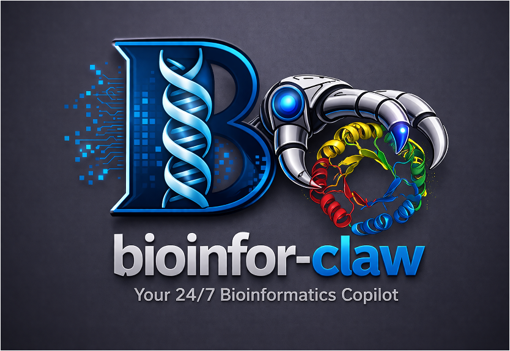

  

<h1 align="center">Bioinfor-Claw</h1>

  <strong>Your 24/7 Bioinformatics Copilot</strong>

  A modular bioinformatics skill repository for AI agents, scientific copilots, and workflow-driven research assistants.

  Bioinfor-Claw organizes reusable bioinformatics capabilities into structured skill sets for dataset access, gene-centered analysis, gene-list interpretation, CRISPR workflows, protein/structure reasoning, literature digestion, lab-oriented search, and scientific figure generation.

---

## Tagline

**Modular bioinformatics skills for AI-native scientific workflows.**

Bioinfor-Claw is built to help researchers and AI assistants work more effectively across modern bioinformatics tasks by turning common workflows into reusable, well-scoped skills.

---

## What is Bioinfor-Claw

Bioinfor-Claw is a **skill-based bioinformatics toolkit**.

Instead of treating bioinformatics work as a collection of isolated scripts, notebooks, websites, and one-off pipelines, Bioinfor-Claw packages recurring scientific tasks into modular skills that can be:

- used directly by researchers
- invoked by AI agents
- combined into larger workflows
- extended over time without redesigning the whole system

A skill may represent something like:

- downloading a public dataset
- analyzing one gene across DepMap, GTEx, or TCGA
- summarizing a gene list
- running a CRISPR design workflow
- mapping variants onto a protein domain or structure
- searching and digesting scientific papers
- generating publication-style figures

This makes the repository useful both as:
- a practical bioinformatics toolbox
- a backend skill library for AI-native scientific assistants

---

## Why this project

Modern bioinformatics workflows are often fragmented across many systems:

- public data portals
- APIs
- notebooks
- plotting scripts
- ad hoc local utilities
- internal lab workflows
- literature databases

As a result, even simple research questions often require many manual steps.

Examples:

- “Show me normal tissue expression of a gene, then compare it across TCGA and DepMap.”
- “Download only the required dataset and run a focused analysis.”
- “Design CRISPR reagents and help interpret a screen.”
- “Map a mutation to protein structure and functional regions.”
- “Search recent papers and summarize the relevant findings.”

Bioinfor-Claw is designed to make these tasks more reusable and more agent-compatible by turning them into well-scoped skills with:

- clear purpose
- explicit inputs
- explicit outputs
- documented execution rules
- reusable implementations

---

## Core design philosophy

Bioinfor-Claw is built around several principles.

### 1. Modular

Each skill should solve one class of tasks clearly.

A skill should be:
- easy to understand
- easy to call
- easy to reuse
- easy to extend or replace

### 2. Agent-friendly

Skills are documented so that an AI agent can:
- identify the correct skill from user intent
- determine the required inputs
- execute the skill with correct parameters
- interpret the outputs and decide what to do next

### 3. Practical

The project is focused on real scientific tasks rather than toy demos.

Typical targets include:
- gene expression analysis
- mutation / copy number / dependency analysis
- CRISPR design and screen interpretation
- literature search and digest
- structure-aware interpretation
- reproducible figure generation

### 4. Extensible

The repository is designed to grow.

New skills can be added without changing the overall structure. New skill sets can also be introduced as the project expands into new analysis areas.

### 5. Reusable

Outputs should be easy to pass downstream.

Where possible, skills should generate reusable outputs such as:
- TSV / CSV
- JSON manifests
- PNG / PDF
- structured summaries
- cached query results

### 6. Separation of concerns

When possible, Bioinfor-Claw separates:
- data access
- analysis
- plotting
- reporting

This reduces duplication and makes agent orchestration cleaner.

---

## Current skill sets

Bioinfor-Claw is currently organized into **10 major skill sets** designed to cover the majority of day-to-day bioinformatics analysis needs.

### 1. public-datasets-access-and-download
Skills for discovering, querying, downloading, caching, and organizing public biological datasets.

Typical use cases:
- dataset release inspection
- file discovery
- selective download
- local cache preparation
- exposing data paths for downstream analysis

### 2. multiomics-data-analysis
Skills for analyzing transcriptomic, genomic, epigenomic, proteomic, metabolomic, and integrated multi-omics data.

Typical use cases:
- RNA-seq analysis
- ATAC-seq / ChIP-seq downstream analysis
- mutation / CNV / expression integration
- cohort-level omics interpretation
- multi-layer biological data analysis

### 3. crispr-design-and-analysis
Skills for CRISPR reagent design and CRISPR-based screen analysis.

Typical use cases:
- sgRNA design
- base editor design
- screen QC
- hit analysis
- tiling-screen interpretation
- perturbation result analysis

### 4. gene-list-analysis
Skills for interpreting and summarizing gene sets or candidate gene lists.

Typical use cases:
- GO analysis
- pathway enrichment
- functional annotation
- list comparison
- candidate prioritization

### 5. gene-centered-analysis
Skills that start from one gene and analyze it across biological contexts and public resources.

Typical use cases:
- normal tissue expression
- tumor expression
- cell-line expression
- mutation / CNV / dependency profiling
- integrated gene-level summaries

### 6. protein-structure-analysis
Skills for protein-centered and structure-aware interpretation.

Typical use cases:
- domain mapping
- mutation annotation on protein features
- structure-aware interpretation
- interface analysis
- protein-level summaries

### 7. machine-learning-and-deep-learning
Skills for machine learning and deep learning workflows in bioinformatics.

Typical use cases:
- classification and regression
- feature selection
- clustering
- dimensionality reduction
- neural network workflows
- model interpretation and explainability

### 8. bioinformatics-plot-generator
Skills for reusable scientific plotting and publication-quality figure generation.

Typical use cases:
- barplots
- boxplots / violin plots
- heatmaps
- QC figures
- screen figures
- summary and presentation-ready plots

### 9. paper-search-and-digest
Skills for scientific literature retrieval, organization, and summarization.

Typical use cases:
- paper search
- literature digestion
- topic-based review
- recent paper tracking
- structured scientific summaries

### 10. lab-search-and-track
Skills for searching and tracking big labs in your research filed

Typical use cases:
- search for big labs in a specific field
- track the progress in the specific labs
- track the hiring information in the labs
- internal workflow assistance
---

## Featured skills

Below are representative examples of the kinds of skills Bioinfor-Claw is designed to support.

### depmap-analysis-for-gene
A gene-centered DepMap workflow for analyzing:
- expression
- mutation
- copy number
- essentiality
- co-expression
- co-essentiality

Useful for questions like:
- “Which cell lines depend on KRAS?”
- “Does ERBB2 show amplification in cancer cell lines?”
- “What is the mutation and dependency profile of TP53?”

### depmap-download-data
A reusable dataset-access skill for:
- listing DepMap releases
- listing files in a release
- downloading only the required datasets
- supporting downstream analysis via cache and manifest outputs

### gtex-expression-for-gene
A normal-tissue expression skill for exploring a gene across GTEx tissues.

Useful for:
- tissue specificity
- broad vs restricted expression
- publication-quality tissue expression figures

### tcga-expression-for-gene
A TCGA-focused gene expression skill for:
- pan-cancer gene expression
- single-cohort expression
- tumor vs normal analysis

### CRISPR design and analysis skills
This skill family is intended to support:
- sgRNA design
- base editor targeting
- screen QC
- hit analysis
- mutagenesis interpretation

### Paper search and digest skills
This skill family is intended to support:
- topic-based paper search
- paper summarization
- literature digestion for specific genes, pathways, or methods

---

## Repository structure

The repository is organized by skill set.

A simplified high-level structure looks like this:

    bioinfor-claw/
    ├── README.md
    ├── assets/
    │   └── logo.png
    ├── bioinformatics-plot-generator/
    ├── gene-list-analysis/
    ├── crispr-design-and-analysis/
    ├── lab-search-and-track/
    ├── datasets-access-and-download/
    ├── paper-search-and-digest/
    ├── gene-centered-analysis/
    └── protein-structure-analysis/

Inside each skill set are one or more individual skills.

Each skill is intended to be independently understandable and reusable.

---

## How a skill is organized

A typical skill directory may contain:

    <skill-name>/
    ├── SKILL.md
    ├── requirements.txt
    ├── scripts/
    └── examples/

### `SKILL.md`
This is the core documentation for the skill.

It typically describes:
- what the skill does
- when it should be used
- what inputs it requires
- what outputs it generates
- execution policy
- agent guidance
- failure conditions

### `requirements.txt`
Lists Python or system dependencies needed by the skill.

### `scripts/`
Contains the executable implementation.

### `examples/`
May contain:
- example commands
- example outputs
- test resources
- sample plots or tables

---

## How Bioinfor-Claw is intended to be used

Bioinfor-Claw supports two main usage modes.

### 1. Direct usage by a human user

A user can:
- navigate to a specific skill
- read the documentation
- install the needed dependencies
- run the script directly with explicit parameters

This is useful for:
- one-off analysis
- local experimentation
- testing and development
- manual scientific workflows

### 2. Agent-integrated usage

An AI agent can:
- inspect `SKILL.md`
- select the best skill for a user request
- resolve the required parameters
- execute the skill
- interpret the outputs
- chain multiple skills together

This is useful for:
- scientific copilots
- modular AI assistants
- workflow automation
- multi-step research support

---

## Typical workflow examples

### Example 1: gene-centered analysis

A user asks:
- “Analyze TP53 in DepMap.”

A possible workflow:
1. a dataset access skill prepares DepMap data
2. a gene-centered analysis skill profiles TP53
3. a plotting skill generates publication-style figures
4. the assistant returns summary tables and plots

### Example 2: literature-supported analysis

A user asks:
- “What papers discuss TP53 dependency in cancer cell lines?”

A possible workflow:
1. paper-search-and-digest retrieves relevant papers
2. gene-centered-analysis analyzes TP53 in a data resource
3. the assistant combines literature findings with data outputs

### Example 3: CRISPR workflow

A user asks:
- “Design CRISPR reagents for a target gene and help interpret the results.”

A possible workflow:
1. crispr-design-and-analysis designs the reagents
2. datasets-access-and-download prepares any needed reference data
3. bioinformatics-plot-generator visualizes downstream results

### Example 4: structure-aware interpretation

A user asks:
- “Map these mutations onto the protein context.”

A possible workflow:
1. protein-structure-analysis annotates domains or structure context
2. plotting or reporting skills generate summary outputs

---

## Installation

Clone the repository:

    git clone https://github.com/<your-username>/bioinfor-claw.git
    cd bioinfor-claw

Install dependencies for the specific skill you want to use.

Example:

    cd datasets-access-and-download/depmap-download-data
    pip install -r requirements.txt

Because Bioinfor-Claw is modular:
- different skills may use different dependencies
- users usually only need to install the dependencies required by the skills they plan to run

---

## Usage

Usage depends on the specific skill.

A typical pattern is:

1. choose the relevant skill set
2. choose the specific skill
3. read its `SKILL.md`
4. install its dependencies if needed
5. run the corresponding script or integrate it into an agent workflow

Example workflow:

    cd gene-centered-analysis/depmap-analysis-for-gene
    pip install -r requirements.txt
    python scripts/depmap_analysis_for_gene.py --help

Skills are generally designed so that:
- inputs are explicit
- outputs are structured
- commands are reproducible
- downstream reuse is straightforward

---

## Integration with agent frameworks

Bioinfor-Claw is designed to work naturally with agent-based systems such as:

- OpenClaw
- modular scientific copilots
- custom orchestration frameworks
- workflow-aware chat assistants

A typical agent pattern is:

1. infer the user’s intent
2. choose the best skill
3. resolve required inputs
4. execute the skill
5. collect outputs
6. optionally call another skill downstream

Example:
- a dataset access skill prepares data
- an analysis skill generates results
- a plotting skill converts outputs into figures
- a literature skill adds scientific context

This design makes Bioinfor-Claw suitable both for direct scripting and for broader AI research assistants.

---

## Development principles

If you add or refine a skill, the following conventions are strongly recommended.

### Keep skills focused
A skill should have a clear purpose. Avoid mixing too many unrelated tasks into one skill.

### Keep interfaces explicit
Inputs, outputs, defaults, and failure conditions should be clear.

### Prefer reusable outputs
Write results into structured formats whenever possible, such as:
- TSV
- CSV
- JSON
- PNG
- PDF
- structured summary text

### Separate infrastructure from analysis
When possible:
- data-access skills fetch or cache data
- analysis skills perform interpretation
- plotting skills visualize results

### Document for both humans and agents
A skill should be understandable:
- by a researcher reading the repo
- by an agent selecting and executing the skill

### Use stable file naming
Consistent naming makes it easier to chain skills together.

### Design for extension
New data backends, new plots, or new analysis modules should be addable without breaking the skill architecture.

---

## Roadmap preview

This first public release focuses on structure and core utility. Planned next steps include:

### Near-term
- improve documentation for each skill set
- add more usage examples and test cases
- refine dataset download and cache workflows
- stabilize key gene-centered analysis skills
- improve integration with agent frameworks such as OpenClaw

### Mid-term
- expand GTEx / TCGA / DepMap coverage
- strengthen CRISPR design and screen analysis workflows
- add more reusable visualization and reporting templates
- improve protein and structure interpretation layers
- build cleaner installation and skill registration tooling

### Longer-term
- connect more public biological data sources
- support richer multi-skill workflows
- develop stronger AI-native scientific assistant behavior
- build a more complete bioinformatics copilot platform across datasets, analyses, plots, and literature

---

## Who this repository is for

Bioinfor-Claw may be useful for:

- computational biologists
- bioinformaticians
- cancer genomics researchers
- functional genomics researchers
- CRISPR screen analysts
- molecular biologists using public omics datasets
- developers building scientific AI assistants
- labs that want reusable bioinformatics workflows

It is especially useful for people who want to bridge:
- public data access
- analysis automation
- agent-based research assistance
- reusable scientific utilities

---

## Current project status

This is the **first public version** of Bioinfor-Claw.

The current release is meant to:
- establish the overall architecture
- make the project publicly visible
- support initial real-world usage
- provide a base for future expansion

At this stage:
- some skill sets are more mature than others
- some skills already support practical workflows
- documentation and examples will continue to improve
- additional skills and refinements will be added over time

This first release should be viewed as:
- a solid starting point
- a usable foundation
- an evolving repository rather than a finished platform

---

## Contributing

Contributions are welcome.

Useful contribution types include:
- new skills
- improvements to existing skills
- documentation improvements
- bug fixes
- new data integrations
- example outputs
- testing and validation
- installation and deployment improvements

When contributing, please try to keep contributions:
- modular
- explicit in inputs and outputs
- easy to reuse
- well documented
- consistent with the existing repository structure

A good contribution usually includes:
- a clear skill purpose
- a `SKILL.md`
- a working implementation
- dependency declaration
- at least one minimal execution example

---

## License

Please add your preferred license here.

Example:

    This project is licensed under the MIT License.

You may replace this with the exact license text or link once you decide the final license for the repository.

---

## Contact

If you are interested in:
- collaboration
- integration
- feedback
- new feature requests
- scientific use cases

please open an issue or contact the maintainer through GitHub.

---

## Vision

Bioinfor-Claw is intended to grow into a reusable skill library for bioinformatics copilots.

The long-term vision is a system where AI agents can:
- access biological data
- reason across datasets
- assist with experimental design
- support literature review
- generate figures and structured outputs
- help with everyday research tasks in a modular and reliable way

This first public version is the starting point.

Bioinfor-Claw is being built as a practical step toward AI-native bioinformatics workflows that are:
- modular
- reusable
- transparent
- extensible
- scientifically useful
