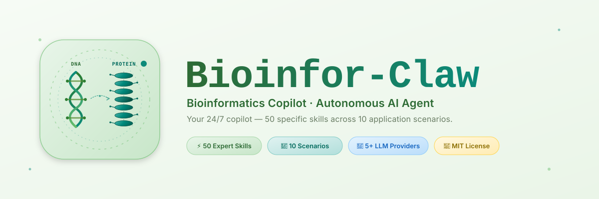

<p align="center">
  
</p>

<p align="center">
  <a href="#quickstart"></a>
  
  
  
  
  
</p>

<p align="center">
  <a href="README.md">English</a> &nbsp;|&nbsp; <strong>简体中文</strong>
</p>

# Bioinfor-Claw

**你的 7×24 小时生物信息学副驾驶 —— 用 10 大应用场景下的 50 项专属技能,轻松完成日常生物信息分析。**

Bioinfor-Claw 在同一个项目中提供两件事:

1. **一个独立的生物信息学 Agent。** 克隆仓库,一条命令启动,即可获得一个基于浏览器的聊天界面,背后是一个能自主选择工具、运行分析、跨轮次记忆上下文、并返回可发表级图表与结果表的自治 Agent。不依赖任何外部 Agent 框架。
2. **一个模块化技能库。** 全部 50 项分析能力都被打包为自包含、Agent 友好的技能(每个技能含 `SKILL.md`、可直接运行的 Python 实现、以及明确的输入/输出契约),可直接接入 OpenClaw、Claude Code,或任何会扫描 `SKILL.md` 文件的自定义 Agent。

这种"一项目两身份"的设计是刻意的。你既可以把 Bioinfor-Claw 当作独立的"桌面版 AI 生信助手"使用;也可以把它嵌入到你已经在用的 Agent 平台里;或者直接在脚本和流水线里调用单个技能 —— 同一份技能库在三种模式下表现一致。

---

## 目录

- [为什么选择 Bioinfor-Claw](#why)
- [核心能力一览](#capabilities)
- [60 秒快速开始](#quickstart)
- [架构](#architecture)
- [适合哪些人](#audience)
- [安装方式](#install)
  - [方式 1 —— 内置 Agent + Web UI](#install-builtin)
  - [方式 2 —— OpenClaw](#install-openclaw)
  - [方式 3 —— Claude Code](#install-claudecode)
  - [方式 4 —— 直接 CLI / 流水线](#install-cli)
- [在线部署](#hosting)
- [内置 Agent —— 功能详解](#agent-features)
- [技能目录](#skills)
- [工作流示例](#workflows)
- [设计原则](#principles)
- [路线图](#roadmap)
- [贡献指南](#contributing)
- [许可证与联系方式](#license)

---

<a id="why"></a>
## 为什么选择 Bioinfor-Claw

现代生物信息分析是高度碎片化的。一个科研问题 —— 比如 *"基因 X 在某种癌症里是否与预后相关?它的突变谱是否提示可做 CRISPR 靶点?"* —— 通常需要跨越公共数据门户、本地分析脚本、绘图 notebook、文献检索工具、结构查看器,再用人工把它们串起来。

Bioinfor-Claw 把这个循环折叠进一个对话式界面,背后是一组经过精心整理、可复现的技能。你用自然语言描述需要什么,Agent 自己挑合适的工具、填好参数、跑起来、把结果连同出处一起返回。在对话层之下,每一项技能依然是一份普通的、文档齐全的 Python 脚本 —— 你可以随时审阅、修改,或脱离 Agent 直接调用。

**具体来说:**

- 对日常分析:不用再在门户、脚本、绘图代码之间来回切换。
- 对可复现性:每项技能都是带明确输入/输出/依赖的版本化脚本,而不是黑盒。
- 对自动化:把技能串成模块化流水线,可手动编排,也可让 Agent 自主编排。
- 对互操作性:同一批 `SKILL.md` 文件既能被 Bioinfor-Claw 自带的 Agent 读,也能被 OpenClaw、Claude Code、或任何你将来迁移到的框架消费。

---

<a id="capabilities"></a>
## 核心能力一览

### 作为自治 Agent

| 能力 | 做什么 |
|---|---|
| 自动路由的 Agent 循环 | 读取 `SKILL.md` 文件,从自然语言请求中挑出正确的技能,补齐必要参数,执行,遇到错误自动修正 |
| 多 LLM 后端 | Anthropic、OpenAI、Google、Mistral、MiniMax —— 另有一个 Custom 标签页,支持任何 OpenAI 兼容的接口(DeepSeek、xAI、Moonshot、Ollama、LM Studio、vLLM……),每次会话可切换 |
| 跨轮次记忆 | 跟踪对话中出现过的实体(基因、癌种、UniProt ID)、最近的分析、以及用户偏好(字体、DPI、物种),让后续追问不丢上下文 |
| 可配置的步数预算 | 默认每轮请求最多 30 次工具调用;当 Agent 检测到模块化 / 多数据集类请求时,自动上调到 45+ |
| 指纹级去重 | 阻止同参数技能的重复运行,同时允许合法的模块化参数扫描 |
| 文件处理 | 支持拖放上传 CSV / TSV / VCF / FASTA / JSON / BED;上传后服务器路径自动接入 `run_script` 参数 |
| 结果渲染 | 内嵌图表预览、合并的下载卡片、可折叠的错误堆栈(供高阶用户查看) |
| 浏览器原生 UI | 单文件 HTML,无需构建步骤;技能打包后可完全离线运行 |

### 作为技能库

| 能力 | 做什么 |
|---|---|
| 50 项专业技能 | 覆盖数据获取、多组学、CRISPR、基因列表、以基因为中心、结构、机器学习、绘图、文献、实验室追踪 |
| 标准化的 SKILL.md | 每项技能声明用途、输入、输出、执行策略、触发短语 —— 人和 Agent 都能直接读懂 |
| 纯 Python 实现 | 基于 numpy / pandas / matplotlib / scipy / lifelines;不依赖 R |
| 每个技能独立的 `requirements.txt` | 只装你需要的依赖 |
| 稳定的文件命名与 TSV/PNG/SVG 输出 | 便于下游继续串接,无需胶水代码 |

### 作为集成组件

| 平台 | 集成方式 |
|---|---|
| Bioinfor-Claw 自带 Agent | 原生集成 —— 启动器自动加载技能 |
| OpenClaw | 一键安装脚本通过 `~/.openclaw/openclaw.json` 的 `extraDirs` 注册全部 50 项技能 |
| Claude Code | 从仓库根目录启动 Claude Code 时,技能自动被发现 |
| 自定义 Agent | 任何会扫描 `SKILL.md` 文件的框架都可以接入;每个技能都有自描述的 argparse 接口 |
| 直接 CLI / Snakemake / Nextflow | 每个技能都是一条独立的 `python script.py --flag value` 命令 |

---

<a id="quickstart"></a>
## 60 秒快速开始

```bash
# 克隆仓库
git clone https://github.com/MDhewei/bioinfor-claw.git
cd bioinfor-claw

# 一次性安装全部 50 项技能的依赖
bash setup.sh --all
source .venv/bin/activate

# 启动自带 Agent + Web UI
python3 run_bioinfor_claw.py
```

浏览器会自动打开 `http://localhost:7860`。点击 **⚙ 设置**,填入任意受支持 LLM 提供商的 API key,然后开始对话:

```
在胃癌中做一下 PRNP 的 TCGA 生存分析
帮我给这份差异表达结果画一张火山图(已附件)
对比 TP53 在所有 TCGA 癌种里的表达
给人类 KRAS 设计一批 SpCas9 sgRNA
```

Agent 会自动读取相关的 `SKILL.md`、挑对脚本、补好参数、在你本地运行,并把图和结果表返回到对话窗口。

---

<a id="architecture"></a>
## 架构

```
                    ┌──────────────────────────────────────────────┐
                    │            浏览器聊天 UI                      │
                    │  (bioinfor-claw.html,单文件自包含;           │
                    │   多 LLM 提供商切换;文件上传;结果汇总面板)   │
                    └────────────────────┬─────────────────────────┘
                                         │  HTTP(本地或隧道)
                    ┌────────────────────▼─────────────────────────┐
                    │            本地 Agent 服务                    │
                    │             run_bioinfor_claw.py             │
                    │  ┌────────────────────────────────────────┐  │
                    │  │  Agent 循环(使用原生工具调用接口)     │  │
                    │  │  • 规划 → 调用工具 → 观察 → 循环       │  │
                    │  │  • 跨轮次记忆(实体、运行历史)          │  │
                    │  │  • 指纹去重、步数预算管理               │  │
                    │  └────────────────────────────────────────┘  │
                    │  ┌────────────────────────────────────────┐  │
                    │  │  工具面                                 │  │
                    │  │  list_skills · read_skill ·             │  │
                    │  │  list_skill_scripts · run_script ·      │  │
                    │  │  list_files · read_file                 │  │
                    │  └────────────────────────────────────────┘  │
                    └────────────────────┬─────────────────────────┘
                                         │
                    ┌────────────────────▼─────────────────────────┐
                    │               技能库                          │
                    │  10 大场景 · 50 项技能                        │
                    │                                              │
                    │  每项技能包含:                                │
                    │    • SKILL.md   (用途、输入、输出、           │
                    │                  执行策略、触发关键词)         │
                    │    • scripts/   (纯 Python 实现)             │
                    │    • requirements.txt                        │
                    └────────────────────┬─────────────────────────┘
                                         │
                                         ▼
                            输出:TSV / CSV / PNG / SVG /
                            JSON / 交互式 HTML / markdown
```

同一个 `技能库` 层既可以被 **OpenClaw** 消费(通过 `extraDirs` 注册),也可以被 **Claude Code** 消费(通过扫描项目根目录),也可以被 **任何自定义 Agent** 消费(只要它会读 `SKILL.md`) —— Bioinfor-Claw 自带的 Agent 只是众多消费者之一。

---

<a id="audience"></a>
## 适合哪些人

Bioinfor-Claw 面向所有需要反复做计算生物学工作的人,目标是让你把更多时间花在科研本身,而不是把时间耗在工具衔接上。

- 计算生物学家 / 生物信息学研究者
- 肿瘤基因组学、功能基因组学研究者
- CRISPR 筛选设计与分析人员
- 依赖公共组学数据的分子生物学家
- 希望学生能安全使用结构化 AI 助手的实验 PI
- 正在构建科研型 AI 助手的开发者
- 希望沉淀可复用、可审计分析流水线的实验室
- 正在做自动化生物信息分析原型的公司

它尤其适合作为以下场景的桥梁:

- 公共数据访问
- 分析自动化
- 基于 Agent 的科研辅助
- 可复用的科研工具

---

<a id="install"></a>
## 安装方式

按你现有的环境挑一种。四种方式共用同一份底层技能库,以后想切换,只需 `git clone` 一下。

| 你的情况 | 推荐使用 |
|---|---|
| 新用户,只想以最少摩擦跑起来 | **方式 1 —— 内置 Agent** |
| 已经在用 OpenClaw 作为日常 Agent | **方式 2 —— OpenClaw** |
| 已经在终端里用 Claude Code | **方式 3 —— Claude Code** |
| 想从脚本 / Snakemake / Nextflow 调用某一项技能 | **方式 4 —— 直接 CLI** |

### 先决条件

- Python ≥ 3.9
- git
- curl(仅 OpenClaw 一键安装需要)

---

<a id="install-builtin"></a>
### 方式 1 —— 内置 Agent + Web UI(推荐,适合新用户)

Bioinfor-Claw 自带一个完整的自治 Agent 和聊天 UI,打包成一个单文件启动器。不需要外部 Agent 框架,不需要 npm,不需要任何额外账号。

#### 步骤 1 —— 克隆并安装依赖

```bash
git clone https://github.com/MDhewei/bioinfor-claw.git
cd bioinfor-claw
bash setup.sh --all          # 安装全部 50 项技能的依赖
source .venv/bin/activate
```

`setup.sh` 可选项:

| 命令 | 作用 |
|---|---|
| `bash setup.sh` | 只装启动器本身的依赖 |
| `bash setup.sh --all` | 一次装完全部 50 项技能的依赖 |
| `bash setup.sh --skill <skill-name>` | 只装某一项技能的依赖 |
| `bash setup.sh --list` | 列出全部可用技能 |

#### 步骤 2 —— 启动 Agent

```bash
python3 run_bioinfor_claw.py
```

启动器会:

1. 扫描仓库,把每个 `SKILL.md` 在启动时打包进应用
2. 在 `7860` 端口启动本地 HTTP 服务
3. 自动用默认浏览器打开聊天 UI

#### 步骤 3 —— 配置并开始对话

在 Web UI 里点右上角的 **⚙ 设置**,选择 LLM 提供商,填入 API key,就可以用中文或英文直接描述需求了。剩下的交给 Agent。

#### 启动器参数

```bash
# 换端口
python3 run_bioinfor_claw.py --port 8080

# 无头模式:不要自动打开浏览器
python3 run_bioinfor_claw.py --no-browser

# 绑定到所有网卡(局域网访问 / 配合隧道,见"在线部署")
python3 run_bioinfor_claw.py --host 0.0.0.0 --port 8000 --no-browser

# 指定到另一个仓库位置
python3 run_bioinfor_claw.py --repo /path/to/bioinfor-claw
```

#### 更新

```bash
cd bioinfor-claw
git pull
bash setup.sh --all       # 装新增依赖
# 重启 run_bioinfor_claw.py 以重新打包更新后的 SKILL.md
```

---

<a id="install-openclaw"></a>
### 方式 2 —— OpenClaw

[OpenClaw](https://openclaw.ai) 是一个开源的自治 AI Agent。它通过扫描目录下的 `SKILL.md` 文件来发现技能。全局安装的技能位于 `~/.openclaw/skills/`;额外目录可以在 `~/.openclaw/openclaw.json` 的 `skills.load.extraDirs` 字段中注册。

`install-openclaw.sh` 脚本一条命令处理完所有事:克隆仓库、安装 Python 依赖、并把全部 50 项技能永久注册到你的 OpenClaw 配置里。

#### 步骤 1 —— 安装 OpenClaw

如果你还没装 OpenClaw,参考 [openclaw.ai](https://openclaw.ai) 的指南。你需要 Node 22+ 以及任一 LLM 提供商的 API key。

#### 步骤 2 —— 运行 bioinfor-claw 安装器

```bash
bash <(curl -sSL https://raw.githubusercontent.com/MDhewei/bioinfor-claw/main/install-openclaw.sh)
```

安装器会:

1. 把 bioinfor-claw 克隆到 `~/.bioinfor-claw/`
2. 创建 Python 虚拟环境并安装全部技能依赖
3. 把 bioinfor-claw 的技能目录加入 `~/.openclaw/openclaw.json` 的 `skills.load.extraDirs`
4. 通过 `openclaw skills list` 验证技能已被发现

> **`extraDirs` 的工作方式:** OpenClaw 的配置支持 `skills.load.extraDirs` 字段 —— 一个目录数组,启动时会被扫描查找技能目录。安装器修改这个数组,让 OpenClaw 每次启动都能自动发现 bioinfor-claw 的全部 50 项技能,全程不复制任何文件。

#### 步骤 3 —— 重启 OpenClaw 并验证

```bash
openclaw restart           # 或者先停止再启动 OpenClaw
openclaw skills list       # 应该能看到全部 50 项 bioinfor-claw 技能
```

#### 步骤 4 —— 开始使用

在 OpenClaw 界面里用自然语言描述需求即可;OpenClaw 会读对应的 `SKILL.md`,选好参数,跑 Python 脚本。

#### 更新技能

因为技能是通过 `extraDirs` 注册(而不是复制),所以更新只需一条 `git pull`:

```bash
git -C ~/.bioinfor-claw pull
```

#### 安装器参数

```bash
# 更改克隆位置(默认 ~/.bioinfor-claw)
bash <(curl -sSL .../install-openclaw.sh) --install-dir ~/tools/bioinfor-claw

# 指定非默认的 openclaw.json 路径
bash <(curl -sSL .../install-openclaw.sh) --config ~/.config/openclaw/openclaw.json

# 把技能直接复制进 ~/.openclaw/skills/,而不是用 extraDirs
bash <(curl -sSL .../install-openclaw.sh) --copy
```

---

<a id="install-claudecode"></a>
### 方式 3 —— Claude Code(终端)

[Claude Code](https://docs.anthropic.com/en/docs/claude-code) 是 Anthropic 官方的终端 AI 编程 Agent。它会自动发现你打开的项目里的 `SKILL.md`,不需要额外注册 —— 克隆仓库,从仓库根目录启动 Claude Code 即可。

#### 步骤 1 —— 安装 Claude Code

```bash
npm install -g @anthropic-ai/claude-code
```

#### 步骤 2 —— 克隆并配置 bioinfor-claw

```bash
git clone https://github.com/MDhewei/bioinfor-claw.git
cd bioinfor-claw
bash setup.sh --all
source .venv/bin/activate
```

#### 步骤 3 —— 从仓库根目录启动 Claude Code

```bash
claude
```

Claude Code 会扫描项目、找到每一个 `SKILL.md`,立刻知道每项技能的用途、适用场景、以及调用方式。

#### 步骤 4 —— 开始使用

```
你:  在 TCGA 乳腺癌里帮我跑一下 TP53 的生存分析
Claude Code: 读取 tcge_survival_for_gene/SKILL.md → 用
             --gene TP53 --cancer-type BRCA --mode os 调用脚本
             → 返回 KM 曲线 + TSV

你:  可视化 EGFR 的 3D 结构,并检测口袋
Claude Code: 读取 protein-structure-visualizer/SKILL.md → 拉 PDB、
             跑口袋检测、返回交互式 HTML 查看器
```

#### 更新

```bash
cd bioinfor-claw && git pull && bash setup.sh --all
```

---

<a id="install-cli"></a>
### 方式 4 —— 直接 CLI / 流水线

每个技能都是一个独立的 Python 脚本,可以被任意 shell、Makefile、Snakemake 规则、或 Nextflow 进程调用 —— 无需任何 Agent 介入。

```bash
# 克隆并配置
git clone https://github.com/MDhewei/bioinfor-claw.git
cd bioinfor-claw
bash setup.sh --skill tcge_survival_for_gene
source .venv/bin/activate

# 直接运行技能
python gene-centered-analysis/tcge_survival_for_gene/scripts/tcga_survival_for_gene.py \
  --gene TP53 --cancer-type BRCA --mode os --outdir results/
```

#### Conda 替代 venv

```bash
conda create -n bioinfor-claw python=3.11 -y
conda activate bioinfor-claw

git clone https://github.com/MDhewei/bioinfor-claw.git
cd bioinfor-claw
bash setup.sh --all
```

---

<a id="hosting"></a>
## 在线部署

内置 Agent 默认本地优先(绑定到 `localhost`),但让手机、平板、或另一台机器能访问它也很简单。按你的安全要求挑一种。

| 方案 | 适合 | 你得到 |
|---|---|---|
| **Tailscale** | 个人使用,只让自己或少数可信设备接入 | 私有虚拟局域网、零公网攻击面、通过 tailnet 天然 SSO |
| **Cloudflare Tunnel** | 少量可控人员访问,希望给一个公开 HTTPS 地址但有邮箱级访问控制 | 公共域名(如 `claw.yourdomain.com`)、自动 TLS、Cloudflare Access 按人放行 |
| **云主机(DigitalOcean / Hetzner / Lightsail 等)** | 常开访问、更大算力、电费和在线时间与笔记本解耦 | 完整 SSH 控制、nginx + Let's Encrypt + basic auth、`systemd` 服务、`web_results/` 持久盘 |

具体起步命令:

```bash
# Tailscale:在主机装好 tailscale 后运行
python3 run_bioinfor_claw.py --host 0.0.0.0 --port 7860 --no-browser
# 在任何 tailnet 设备访问 http://<机器名>:7860

# Cloudflare Tunnel:服务仍绑定在 localhost
cloudflared tunnel --url http://localhost:7860
# 然后在生成的域名上加一条 Cloudflare Access 策略

# 云主机:通过 nginx 反向代理 + HTTPS
# (用 systemd 起启动器;用 443 + Let's Encrypt + basic auth 对外暴露)
```

前端会自动检测服务源地址,本地和远程切换时无需改代码。

> **安全提示:** Agent 可以执行任意技能(即在主机上运行 Python 脚本)。未加认证层(至少 Tailscale、Cloudflare Access 或 HTTP basic auth 之一)之前,**绝对不要** 把 `run_bioinfor_claw.py` 直接暴露在公网上。把它当成 SSH 端点对待。

---

<a id="agent-features"></a>
## 内置 Agent —— 功能详解

### 自动路由

Agent 的工具面刻意做得很窄:`list_skills`、`read_skill`、`list_skill_scripts`、`run_script`、`list_files`、`read_file`。对每条请求,Agent 调用 `list_skills` → 读对应的 `SKILL.md` → 视需要通过 `list_skill_scripts` 看 argparse → 以完整参数调用 `run_script`。stderr 里的报错会被捕获,下一轮里自动修正。

### 跨轮次记忆

对话轮次之间的状态会被保留:

- **实体追踪**:双方提到的基因、癌种、UniProt ID、PDB ID、物种
- **分析历史**:最近 20 条成功运行(技能、脚本、参数、关键发现、输出文件)
- **用户偏好**:字体、DPI、物种,以及其他反复出现的风格偏好,从历史请求中学到
- **会话上下文摘要**:一段紧凑的一段式综述,注入系统提示词 —— 这样追问时 Agent 不会反问"你说的是哪次分析?"

最近 12 轮原文发送;更早的会被摘要,以守住 token 预算。

### 可配置的步数预算

每条用户请求最多允许 N 轮 Agent 迭代(默认 30,可在 ⚙ 设置里从 8 调到 60)。当请求看起来是模块化的("所有 TCGA 癌种"、"在这个基因上跑每一个模块"、或其他匹配多数据集的模式),预算会自动至少上调到 45,让 Agent 能跑完。

### 指纹级去重

Agent 为每条请求维护一份 `(技能, 脚本, 输入文件, 参数)` 指纹集,只对成功运行计入。重复发起同参数调用,会返回"已阻止"工具结果并提示继续下一模块或开始总结。脚本不同或参数不同总是放行 —— 模块化工作流不受影响。

### 多 LLM 后端

| 提供商标签 | 默认模型 | 工具调用翻译 |
|---|---|---|
| Anthropic | claude-sonnet-4-5 | 原生 |
| OpenAI | gpt-4o-mini | 原生 |
| Google | gemini-2.0-flash-exp | OpenAI 兼容 |
| Mistral | mistral-large | OpenAI 兼容 |
| MiniMax | minimax-text-01 | OpenAI 兼容 |
| Custom | 用户自定义(OpenAI 兼容) | OpenAI 兼容 |

五个一等公民提供商标签,外加一个 **Custom** 标签,支持任何 OpenAI 兼容的 `/v1/chat/completions` 接口 —— 所以 DeepSeek、xAI/Grok、月之暗面(Moonshot)、Ollama、LM Studio、vLLM、llama.cpp server、以及你自己的内网 LLM,都能零改代码接入。UI 里随时切换,不必重启;对话历史会被保留。

### 文件处理

直接把文件拖进聊天框即可。启动器会把文件上传到 `web_results/uploads/`,返回服务器端路径,Agent 随后把这个路径作为 `input_file` 参数传给 `run_script`。支持 CSV、TSV、FASTA、FASTQ、VCF、TXT、JSON、BED、GFF、GTF、SAM、XLSX、PDF。

### 结果渲染

每次 `run_script` 的输出都会被收集、按 URL 去重,渲染到 Agent 回复正文下方的一张统一"输出文件"卡:PNG/SVG 图以缩略图形式内嵌显示,TSV/CSV 给出下载按钮,HTML 查看器在新标签页打开。完整 Agent trace 默认折叠,供排错时展开。

---

<a id="skills"></a>
## 技能目录

Bioinfor-Claw 当前组织为 **10 大应用场景,覆盖 50 项技能**。每项技能都附带一个 `SKILL.md`、一份可运行的 Python 实现、以及一个 `requirements.txt`。

### 1. public-datasets-access-and-download —— 公共数据集访问与下载(3 项)
发现、查询、下载、缓存、组织来自 NCBI GEO、TCGA/GDC、GTEx、DepMap 的公共生物数据集。

| 技能 | 关键输入 | 关键输出 |
|---|---|---|
| `depmap-data-download` | 版本号、文件类别 | 下载的 TSV 文件、manifest JSON |
| `tcga-download-data` | 癌种、数据类型(表达/突变/CNV/临床) | 合并矩阵 TSV、manifest JSON |
| `gtex-download-data` | 数据类型、基因、组织、版本 | 组织-基因表达矩阵 TSV |
| `geo-download-data` | GSE 登录号 | 表达矩阵、样本元数据、系列信息 TSV |

### 2. multiomics-data-analysis —— 多组学数据分析(5 项)
转录组、基因组、表观组、蛋白组、单细胞数据分析。

| 技能 | 关键输入 | 关键输出 |
|---|---|---|
| `rnaseq-differential-expression` | count 矩阵、样本元数据、分组标签 | 差异表达表、火山图、MA 图、热图 |
| `atac-chipseq-downstream-analysis` | BED/narrowPeak 文件、基因组版本 | 注释 peaks TSV、QC 图、差异 peaks |
| `methylation-analysis` | beta 矩阵、样本元数据 | DMP/DMR 表、火山图、聚类热图 |
| `proteomics-analysis` | 蛋白强度矩阵、样本元数据 | 归一化矩阵、差异表、火山图、热图 |
| `single-cell-basic-analysis` | 原始 count 矩阵(细胞 × 基因) | UMAP、聚类标签、Marker 基因 TSV、QC 图 |

### 3. crispr-design-and-analysis —— CRISPR 设计与分析(6 项)
跨编辑类型的 CRISPR 试剂设计与 CRISPR 筛选分析。

| 技能 | 关键输入 | 关键输出 |
|---|---|---|
| `design-sgrnas-by-gene` | 基因名、物种 | 含 on/off-target 评分的 sgRNA 表 |
| `design-base-editor-sgrnas` | 基因名、编辑器类型(CBE/ABE/双编辑) | 排序后的 guide 表、编辑热图、guide 图 |
| `design-prime-editor-sgrnas` | 基因、编辑类型(SNV/插入/缺失)、编辑器 | pegRNA 表(含 PBS/RT 模板)、切口 sgRNA |
| `crispr-screen-analysis` | count 表或 FASTQ、处理/对照标签 | 基因汇总、火山图、rank 图、hit TSV |
| `crispr-screen-qc` | sgRNA count 矩阵 | QC 指标 TSV、Gini 系数、重复相关性图 |
| `crispr-library-design` | 基因列表、每基因 guide 数、编辑器类型 | 订购 oligo TSV、FASTA、GC/得分分布图 |

### 4. gene-list-analysis —— 基因列表分析(7 项)
解释、总结基因集或候选基因列表。

| 技能 | 关键输入 | 关键输出 |
|---|---|---|
| `function-annotation-for-gene-list` | 基因列表 | 功能注释 TSV |
| `go-analysis-for-gene-list` | 基因列表、物种 | GO/KEGG/Reactome 富集 TSV、气泡图 |
| `gsea-for-ranked-gene-list` | 排序后的基因列表 | GSEA 结果 TSV、富集图 |
| `curate-gene-list-by-function` | 主题 / 功能描述 | 人工筛选后的基因列表 TSV |
| `gene-list-overlap` | 2–6 个基因列表文件 | Jaccard 矩阵、Venn/UpSet 图、交集 TSV |
| `ppi-network-for-gene-list` | 基因列表 | STRING 网络边、节点指标、网络图 |
| `transcription-factor-enrichment` | 基因列表 | TF 排名 TSV、柱状图、TF–基因网络图 |

### 5. gene-centered-analysis —— 以基因为中心的分析(8 项)
从单个基因出发,跨多种生物学语境与公共资源进行分析。

| 技能 | 关键输入 | 关键输出 |
|---|---|---|
| `depmap-analysis-for-gene` | 基因名、DepMap 文件 | 表达/突变/CNV/依赖性 TSV + 图 |
| `normal-tissue-expression-by-gene` | 基因名 | GTEx 组织表达 TSV + 柱状图 |
| `tcga-expression-for-gene` | 基因名、模式 | 泛癌或队列表达 TSV + 图 |
| `tcge-survival-for-gene` | 基因名、TCGA 队列 | KM 曲线(OS/DFS)、log-rank p 值、生存 TSV |
| `mutation-analysis-for-gene` | 基因名、癌种 | lollipop 图、突变频率柱状图、热点 TSV |
| `drug-sensitivity-for-gene` | 基因名、PRISM 数据 | 药物相关性 TSV、散点图 + 瀑布图 |
| `coexpression-for-gene` | 基因名、数据集 | 共表达 TSV、网络图、可选 GO 富集 |
| `cox-survival-analysis` | 临床/分子矩阵、时间 + 事件列 | HR 表、森林图、Schoenfeld 残差、风险评分 |

### 6. protein-structure-analysis —— 蛋白结构分析(5 项)
以蛋白、结构为中心的解读。

| 技能 | 关键输入 | 关键输出 |
|---|---|---|
| `protein-structure-for-gene` | 基因名 | UniProt 特征 TSV、PDB 表、AlphaFold 条目、结构域图 |
| `protein-structure-visualizer` | PDB ID / UniProt / 本地 PDB | HTML 3D 查看器、接触图、B-factor 图、口袋 TSV |
| `protein-sequence-analysis` | 基因名或 UniProt ID | 特征图 PNG、理化性质、motif TSV |
| `protein-structure-alignment` | 两个 PDB ID 或文件 | RMSD、对齐后结构、差异图 |
| `protein-variant-mapper` | 基因、突变列表(如 A123V) | lollipop 图、标注突变的 3D HTML 查看器 |

### 7. machine-learning-and-deep-learning —— 机器学习与深度学习(3 项)
基于组学数据的 ML 工作流。

| 技能 | 关键输入 | 关键输出 |
|---|---|---|
| `omics-ml-classifier` | 特征矩阵、标签文件 | 交叉验证指标、ROC 曲线、特征重要性、混淆矩阵 |
| `dimensionality-reduction` | 数值矩阵、元数据 | PCA/UMAP/t-SNE 投影 TSV + 散点图、loading |
| `clustering-analysis` | 数值矩阵 | 聚类标签 TSV、silhouette 图、热图、树状图 |

### 8. bioinformatics-plot-generator —— 生物信息可视化(5 项 + 1 路由)
从生物信息结果表直接出版级出图。每个子技能带 40–70 个可配置参数,300 DPI PNG + SVG 输出,全套发表级风格。

| 技能 | 关键输入 | 关键输出 |
|---|---|---|
| `plot-volcano` | 结果表(含 FC + p 值列) | 300 DPI PNG + SVG、注释 TSV、象限计数 |
| `plot-heatmap` | 数值矩阵 | 带树状图和注释条的聚类热图 |
| `plot-box-violin` | 数值 + 分组列 | 箱/小提琴/raincloud + 两两统计括号 |
| `plot-scatter-bar` | 数值列或矩阵 | 散点图、柱状图、MA、相关矩阵、气泡图 |
| `plot-survival` | 时间、事件、分组列 | KM 曲线、log-rank p、at-risk 表、300 DPI PNG + SVG |

### 9. paper-search-and-digest —— 文献检索与摘要(4 项)
科研文献检索、精读与预印本追踪。

| 技能 | 关键输入 | 关键输出 |
|---|---|---|
| `big-papers-weekly-report` | 主题关键词、时间范围 | 排名后的论文 TSV + PDF 报告 |
| `paper-digest-single` | PMID / DOI / arXiv ID | 结构化 markdown 摘要、元数据 JSON |
| `pubmed-search` | PubMed 查询串、时间范围 | 结果 TSV、markdown 报告、关键词 + 时间线图 |
| `preprint-tracker` | 关键词、时间范围、服务器 | 预印本 TSV、精读报告、趋势图 |

### 10. lab-search-and-track —— 实验室检索与追踪(3 项)
检索、追踪、发现研究型实验室与合作者。

| 技能 | 关键输入 | 关键输出 |
|---|---|---|
| `search-big-labs-by-field` | 研究领域 | 实验室/PI 表(含发表指标) |
| `track-lab-publications` | PI 姓名、机构、年份 | 发表 TSV、实验室报告 markdown、时间线图 |
| `find-collaborators` | 主题列表、年份 | 合作者排名 TSV、作者-主题热图、档案 |

---

<a id="workflows"></a>
## 工作流示例

技能刻意设计成可串接的形式 —— 一个技能的输出直接作为下一个技能的输入。你用自然语言描述目标时,内置 Agent 可以自主执行这些链条。

### 示例 1 —— 单基因全景刻画

> *"给我 EGFR 的完整画像 —— 表达、突变、药敏、结构、生存。"*

```
depmap-data-download              → 下载表达 + 依赖性 + PRISM 文件
depmap-analysis-for-gene          → 在所有细胞系里刻画 EGFR
drug-sensitivity-for-gene         → 与 EGFR 表达相关的 PRISM Top 药物
tcga-download-data                → 下载 TCGA LUAD 表达 + 突变
tcga-expression-for-gene          → 泛癌表达 + LUAD 肿瘤 vs 正常
mutation-analysis-for-gene        → 体细胞突变 lollipop 图、热点分析
cox-survival-analysis             → 含 EGFR + 临床协变量的多变量 Cox 模型
gtex-download-data                → 下载 GTEx TPM 矩阵
normal-tissue-expression-by-gene  → GTEx 正常组织表达分布
protein-structure-for-gene        → UniProt 结构域图、PDB 结构、AlphaFold 条目
protein-structure-visualizer      → 交互式 3D 查看器、口袋检索
protein-sequence-analysis         → 理化性质、motif、PTM 位点
```

### 示例 2 —— RNA-seq → 通路 → 网络 → 生存

> *"我有处理 vs 对照的 RNA-seq 数据。哪些通路变化、哪些转录因子驱动、以及 Top hit 是否影响生存?"*

```
rnaseq-differential-expression    → 差异表 + 显著基因列表
plot-volcano                      → 发表级差异火山图
go-analysis-for-gene-list         → 差异基因的 GO/KEGG/Reactome 富集
gsea-for-ranked-gene-list         → 对完整排序列表做 GSEA
transcription-factor-enrichment   → 驱动该基因集的 TF
ppi-network-for-gene-list         → Top 差异基因的 STRING PPI 网络
coexpression-for-gene             → Top hit 在 TCGA 的共表达伙伴
tcge-survival-for-gene            → Top hit 的 KM 生存
cox-survival-analysis             → 含临床混杂的多变量 Cox 回归
```

### 示例 3 —— CRISPR 筛选 → hit 验证 → 文库设计

> *"我跑了一个 CRISPR 筛选,做 QC、鉴定 hit、在 DepMap 里验证,然后设计一个聚焦的后续文库。"*

```
crispr-screen-qc                  → Gini、重复相关性、representation QC
crispr-screen-analysis            → MAGeCK RRA hit 鉴定、火山图 + rank 图
depmap-analysis-for-gene          → DepMap 依赖性验证 Top hit
go-analysis-for-gene-list         → hit 基因列表的通路富集
ppi-network-for-gene-list         → hit 的 PPI 网络
crispr-library-design             → 针对 Top 50 hit 的聚焦后续文库
```

### 示例 4 —— 单细胞 → 差异 → 结构

> *"分析我的 scRNA-seq 数据,找细胞类型 marker,然后对 Top marker 基因做结构分析。"*

```
single-cell-basic-analysis        → QC、UMAP、聚类、marker 基因鉴定
gene-list-overlap                 → 把 marker 与已知细胞类型 signature 比较
go-analysis-for-gene-list         → 每类细胞 marker 的通路富集
dimensionality-reduction          → 用自定义元数据上色重跑 PCA/UMAP
protein-structure-for-gene        → Top marker 基因的结构域图与结构
protein-variant-mapper            → 把已知疾病突变映射到结构上
```

### 示例 5 —— 生物标志物机器学习发现 → 出版图

> *"多组学数据能区分应答者 vs 非应答者吗?顺便把论文配图也出了。"*

```
tcga-download-data                → 从 TCGA 下载表达 + 临床
omics-ml-classifier               → 随机森林分类器、ROC、SHAP 重要性
clustering-analysis               → 一致性聚类鉴定亚型
dimensionality-reduction          → PCA/UMAP 按亚型和应答着色
cox-survival-analysis             → 分子亚型的生存影响
plot-heatmap                      → 每亚型 Top 特征的发表级热图
plot-survival                     → 各亚型 KM 曲线(含 log-rank + at-risk)
plot-scatter-bar                  → SHAP 特征重要性柱状图
```

### 示例 6 —— 文献 → 合作者 → 实验室追踪

> *"我想进 CRISPR 碱基编辑这个方向。找关键论文、头部实验室、以及可能的合作者。"*

```
pubmed-search                     → PubMed 检索 base editing 论文(2021–2024)
preprint-tracker                  → 近期 bioRxiv 预印本
paper-digest-single               → Top 5 论文的结构化摘要
search-big-labs-by-field          → base editing 的头部实验室
find-collaborators                → 按主题重合度找潜在合作者
track-lab-publications            → Top 3 PI 的发表历史
```

### 示例 7 —— Prime Editing → 设计 → QC

> *"我想在肿瘤细胞里用 prime editing 纠正 TP53 R175H 热点突变。"*

```
design-prime-editor-sgrnas        → 为 TP53 R175H 设计 pegRNA + 切口 sgRNA
mutation-analysis-for-gene        → 验证 R175H 是 TCGA 中已知热点
protein-variant-mapper            → 把 R175H 可视化到 TP53 3D 结构
protein-sequence-analysis         → 检查编辑窗口上下文、PTM 邻近性
crispr-library-design             → 在编辑位点周围做 tiling 文库用于验证
```

---

<a id="principles"></a>
## 设计原则

Bioinfor-Claw 围绕五条原则设计,对既有技能与任何新贡献一视同仁。

**模块化。** 每项技能只解决一个边界清晰的问题;要易理解、易调用、易复用、易扩展、易替换。

**Agent 友好。** 技能要能让 Agent 根据用户意图选对技能、确定必要输入、用正确参数执行、解读输出、决定下一步。`SKILL.md` 格式就是这份契约。

**实用。** 只做真实科研任务,不做玩具 demo:基因表达与依赖分析、突变与 CNV 分析、CRISPR 设计与筛选解读、文献精读、结构感知的突变解读、可复现的发表级出图。

**可扩展。** 新技能、新数据集、新图型可以在不改动架构的前提下加入;新技能组可以随项目规模扩展引入。

**可复用。** 输出要便于往下游传递 —— TSV / CSV、JSON manifest、PNG / PDF / SVG、结构化摘要、缓存查询结果。能用标准格式就不要自创。

贡献时请遵守:

- 技能要聚焦,一个技能只做一件事
- 输入、输出、默认值、失败条件都要写进 `SKILL.md`
- 能用通用输出就不用自定义格式
- 在合理处把基础设施(数据访问)、分析、绘图三者分离
- 文档面向人与 Agent 同时书写 —— `SKILL.md` 两者都会读
- 使用稳定、可预测的文件命名,让下游技能可以串接

---

<a id="roadmap"></a>
## 路线图

### 已完成

- **内置 Agent**:自治工具调用循环、多 LLM 提供商切换、跨轮次记忆(实体、分析、偏好)、可配置步数预算(对模块化工作流自动上调)、指纹去重、文件上传管线、合并后的结果渲染、单文件浏览器原生 UI
- **公共数据集**:DepMap 下载、TCGA/GDC 下载(表达 / 突变 / CNV / 临床)、GTEx 下载(中位 TPM、样本级)、GEO 系列下载与矩阵解析
- **多组学**:RNA-seq 差异表达、ATAC-seq/ChIP-seq peak 注释与差异分析、DNA 甲基化 DMP/DMR、质谱蛋白组(TMT/LFQ/DIA)、单细胞 RNA-seq(QC / 归一化 / 聚类 / marker)
- **CRISPR**:SpCas9/Cas12 sgRNA 设计、碱基编辑器 sgRNA 设计(CBE/ABE/双编辑,13 种预置)、prime 编辑 pegRNA 设计、pooled 筛选分析(MAGeCK RRA/MLE + Python 兜底)、筛选 QC、pooled 文库设计
- **基因列表**:GO/KEGG/Reactome 富集、GSEA、功能注释、AI 辅助基因筛选、2–6 路基因列表交集(Venn/UpSet + Fisher 精确)、STRING PPI 网络、TF 富集(ChEA3 + DoRothEA)
- **以基因为中心**:DepMap 表达/依赖/CNV、GTEx 正常组织表达、TCGA 泛癌表达与 KM 生存、体细胞突变 lollipop 图、PRISM 药敏相关性、共表达网络、Cox 比例风险回归
- **蛋白结构**:UniProt 结构域注释、PDB/AlphaFold 拉取、带口袋检测的交互式 3D 查看器、序列理化分析与 motif 扫描、结构对齐与 RMSD、变异到 3D 结构的映射
- **机器学习**:组学分类(RF/LR/SVM/XGBoost + ROC/SHAP)、PCA/UMAP/t-SNE 含 loading、k-means/层次/DBSCAN/一致性聚类(含 silhouette)
- **绘图**:5 个发表级子技能(火山图、热图、箱/小提琴/raincloud、散点/柱/MA/相关矩阵/气泡、Kaplan–Meier)
- **文献**:周度高影响力论文监测、单篇结构化精读、含引用数与趋势图的 PubMed 检索、bioRxiv/medRxiv 预印本追踪
- **实验室追踪**:按方向搜头部实验室、PI 发表追踪、按主题重合度找合作者
- 每个技能配标准化 `requirements.txt`;纯 Python 技术栈(numpy/pandas/matplotlib/scipy/lifelines),无 R 依赖

### 近期计划

- ENCODE ChIP-seq / ATAC-seq 数据整合
- 含自动归一化的 GEO 批量 RNA-seq
- 多组学整合(在同一样本上关联表达 + CNV + 突变)
- 端到端工作流模板(预配置的技能链,Agent 一键启动)
- 服务器端 LLM 代理与每用户配额(让一个托管实例能服务多人,各自不必自带 API key)

### 中期计划

- 从表达谱预测药敏(CTD² / PRISM 二次利用)
- ClinicalTrials.gov 检索与整合技能
- 扩展公共数据连接器(cBioPortal、COSMIC、GTEx v10)
- scRNA-seq 轨迹分析与伪时间
- 内置 UI 的持久化项目工作区(多个平行分析,状态互相隔离)

### 长期计划

- 更深层的 AI 原生编排:多技能规划、中间结果解读、假设生成
- 插件系统,让实验室自有技能与公共目录并行加载
- 面向不想自托管的实验室的可选托管服务

---

## 项目状态

Bioinfor-Claw 当前覆盖 **10 大应用场景下的 50 项技能**,外加一个可用于生产的内置 Agent 和 Web UI。每项技能都配有 `SKILL.md`(含明确的输入、输出、执行策略、Agent 触发示例)、可运行的 Python 实现、以及 `requirements.txt`。项目已能胜任上述日常工作流,并在持续演进。

---

<a id="contributing"></a>
## 贡献指南

欢迎贡献 —— 新技能、既有技能改进、文档、Bug 修复、新数据集成、示例输出、测试、部署改进都欢迎。

请保持贡献的模块化、输入/输出明确、易复用、文档齐全、并与既有仓库结构一致。一次好的贡献通常包含:清晰的技能用途、一份 `SKILL.md`、可运行的实现、一份 `requirements.txt`、以及至少一条最小可执行示例。

---

<a id="license"></a>
## 许可证与联系方式

本项目采用 **MIT 许可证**。详情见 `LICENSE`。

合作、集成、反馈、功能请求或科研用例,请在 GitHub 上提 issue 或联系维护者。

---

## 愿景

Bioinfor-Claw 的目标,是成长为一个面向 AI 原生生物信息学的完整平台:一个可以访问生物学数据、跨数据集推理、协助实验设计、支持文献调研、生成发表级图表、并且能帮到日常科研的自治 Agent —— 模块化、可复用、透明、可扩展、对科研真实可用。

内置 Agent 是这一愿景的第一次落地;技能库是它的基石;与 OpenClaw、Claude Code 的集成让同一份基石可以随团队迁移到任何它已经在用的地方。
